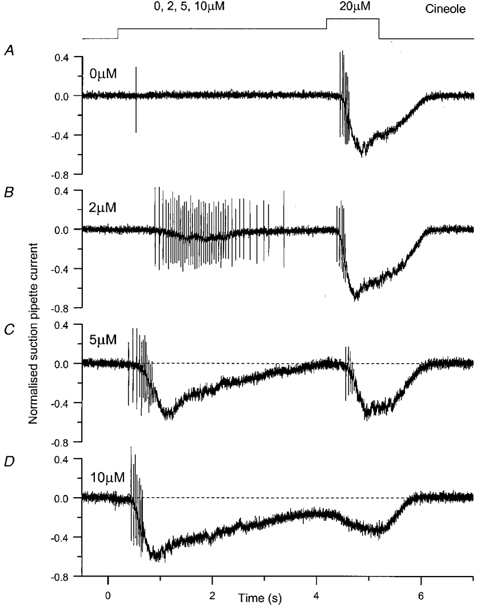

```{r global-options, include=FALSE}
knitr::opts_chunk$set(echo=FALSE,fig.align='center') #warning=FALSE, message=FALSE
```

\newpage
\floatplacement{figure}{!htb}

<!-- Text  -->
# Introduction

Is the problem motivated convincingly?
Is it described clearly? Is a central hypothesis stated clearly?
Are the relevant equations derived appropriately?


\clearpage

# Methods

Mathematical model and its parameters for simulating frog olfactory receptor neuron was used for signal-transduction modeling [@dougherty05computational]. The existing simulation script found on ModelDB [@dougherty05modeldb] was uploaded in 2005 and allows the user to tweak parameters and stimulus conditions in an interactive way. It then generates plain text-files containing all configurations and simulation response, which can be read by other programs. It did not work out-of-the box for my current version of MATLAB R2021a, as it used deprecated functions. I reimplemented their odor-transaction model using a set of parameters optimized for matching ORN adaptation responses. I introduced three additional ODEs to generate spikes to match ORN's responses found in a separate study [@reisert99adaptation]. 

## Spiking ORN model

Figure-\@ref(fig:model) represents a complete diagram explaining the spiking ORN model with some of the parameters. Blue nodes reimplemented from the transduction-model; red nodes are introduced in this study.

```{r model, engine="dot", code=xfun::read_utf8('spiking_ORN_model.gv'), out.width="110%", fig.cap="Spiking ORN mechanistic model diagram", cache=TRUE}

```

Olfactory receptor neuron (ORN) transduction model parameters (blue nodes in Fig-\@ref(fig:model))

- **bLR** : Ligand-bound receptors proportion
- **aG** : Active-state G-proteins proportion
- **cAMP** : Cyclic adenosine monophosphate (AMP) proportion
- **Ca** : cytosolic free $Ca^{2+}$ ions
- **IX** : $Ca^{2+}$-dependent intermediary substance proportion
- **CaCaM** : $Ca^{2+}$-calmodulin proportion
- **aCaMK** : active proportion of **CaCaM**-dependent protein kinase (CaMK)
- **V_ORN** : ORN intracellular voltage

Spiking mechanism model parameters implemented in this study (red nodes in Fig-\@ref(fig:model))

- **O_stim** : Odor pulse indicating the stimulus status
- **V_ML** : Morris-Lecar (ML) voltage for spiking mechanism
- **nK** : ML channel for $K^+$-ions activation proportion
- **CaFR** : $Ca^{2+}$-dependent ML spike firing-rate modulation
- **I_ORN** : ORN membrane current prediction

## ORN : odor-transduction

```{r txCon, out.width = "50%", fig.cap="Transduction comparison for various odor concentration", fig.subcap=c('Cell current raw traces', 'Quantification')}
knitr::include_graphics(c('figs/v1/fig_txn_compare_conc.png','figs/v1/fig_txn_compare_conc_quant.png'))
```

Figure-\@ref(fig:txCon)(a) shows odor-transduction response for a variable concentration 1 second long stimulus pulse. And, (b) compares to plateau current (measured at 1.5 sec) and peak current for a given stimulus. (Experimental data in Fig-\@ref(fig:r99f24))

#### Ligand-receptor binding and G-protein activation modeling {-}

In the equation for a single pulse of odor-stimulus ($O_{\rm stim}$), **_H_(.)** is the Heaviside step function and **od** represents odor-concentration. Parameters for the odorant-binding proportion $\mathbf{bLR}$ equation are the following : k1=0.1143, r1=3.1663, and normalized maximum receptor count, Rtot = 1. Similarly, for $\mathbf{aG}$, Gtot=1, k2=12.9344 and r2=6.5597.

\begin{equation}(\#eq:tx1)
\begin{split}
O_{\rm stim} &= {\rm od} \cdot [ H(t-t_0) - H(t-t_1) ];\ \ \ \ \  \text{(single pulse)}  \\
\frac{d\ \mathbf{bLR}}{dt} &= {\rm k1} \cdot O_{\rm stim} \cdot ({\rm Rtot} - \mathbf{bLR}) - {\rm r1} \cdot \mathbf{bLR} \\
\frac{d\ \mathbf{aG}}{dt} &= {\rm k2} \cdot \mathbf{bLR} \cdot ({\rm Gtot} - \mathbf{aG}) - {\rm r2} \cdot \mathbf{aG}
\end{split}
\end{equation}

#### Intracellular signalling and adaptation {-}

```{r txAdp, out.width = "70%", fig.cap="Transduction comparison for adaptation"}
knitr::include_graphics(c('figs/v1/fig_txn_compare_adaptation.png')) 
```

Figure-\@ref(fig:txAdp) demonstrates olfactory adaptation due to a 4 seconds long low concentration (5uM) pre-stimulus pulse. The following test-pulse of 1 second shows that it requires about 4 times stronger (20uM) pulse to get similar current output due to sensory adaptation. (Experimental data in Fig-\@ref(fig:r99f24))

\begin{equation}(\#eq:tx2)
\begin{split}
\frac{d\ \mathbf{cAMP}}{dt} &= synth - {\rm pd} \cdot \mathbf{cAMP} \\
\frac{d\ \mathbf{Ca}}{dt} &= {\rm inf}\cdot I_{\rm CNG} - J_{\rm NCX} - ({\rm cc1} \cdot \mathbf{Ca} - {\rm cc2} \cdot \mathbf{CaCaM}) \\
\frac{d\ \mathbf{CaCaM}}{dt} &= {\rm cc1} \cdot \mathbf{Ca} - {\rm cc2} \cdot \mathbf{CaCaM} \\
\frac{d\ \mathbf{aCaMK}}{dt} &= {\rm ck1} \cdot \mathbf{CaCaM} - {\rm ck2} \cdot \mathbf{aCaMK} \\
\frac{d\ \mathbf{IX}}{dt} &= {\rm cx1} \cdot \mathbf{Ca} - {\rm cx2} \cdot \mathbf{IX} \\
& synth = \frac{\mathbf{aG} \cdot {\rm smax}}{1 + (\mathbf{aCaMK} / {\rm kinh} )^{\rm ninh}} \\
& J_{\rm NCX} = {\rm ef}\cdot \mathbf{Ca}/[1+(\mathbf{IX}/{\rm kI})^{\rm nI}] \\
\end{split}
\end{equation}

Equations-\@ref(eq:tx2) are responsible for intracellular calcium mediated signaling that is responsible for transduction adaptation.  Here are the parameters used : pd=7.5749, smax=45.5118, kinh=1.0018, ninh=1.3081 (for $\mathbf{cAMP}$); inf=1.7619, cc1=0.7750, cc2=26.3950 (for $\mathbf{Ca}$ and $\mathbf{CaCaM}$); cnmax=0.9663, vcng=0.0106, hmc1=1.4829, n1=3.1844, inhmax=3.5697, kinhcng=0.5181, ninhcng=1.4511 (for $I_\mathbf{CNG}$), ef=2.7583, kI=10.0453, nI=1.9848 (for $J_\mathbf{NCX}$); ck1=8.5342, ck2=0.3069 (for $\mathbf{aCaMK}$); cx1=1.2307, cx2=10.9297 (for $\mathbf{IX}$).

Here, $I_{\rm CNG}$ represents depolarizing  $Ca^{2+}$-ion current through cyclic nucleotide-gated (CNG) channels, and $J_\mathbf{NCX}$ is the $Ca^{2+}$-ions flux through Na/Ca exchanger (NCX). Whereas, $\mathbf{IX}$ is a mathematical $Ca^{2+}$-ion stimulated intermediate substance.

#### Effector Channel Activity and cell currents for transduction {-}

\begin{equation}
\begin{split}
\frac{d\ \mathbf{V_{ORN}}}{dt} &= \frac{1}{\rm cap} \cdot (\ I_{\rm CNG} + I_{\rm Cl(Ca)} + I_{\rm leak}\ ) + {\rm revCp} \cdot \mathbf{\dot{V}_{ML}} \\
I_{\rm CNG} &= \frac{{\rm cnmax} \cdot \mathbf{cAMP}^{\rm n_1} \cdot ({\rm vcng}-\mathbf{V_{ORN}})}{\mathbf{cAMP}^{\rm n_1} + (inhcng \cdot {\rm hmc_1})^{\rm n_1}} \\
& inhcng = 1 + \frac{({\rm inhmax}-1)\cdot \mathbf{CaCaM}^{\rm ninhcng}}{\mathbf{CaCaM}^{\rm ninhcng} + {\rm kinhcng}^{\rm ninhcng}} \\
I_{\rm Cl(Ca)} &= \frac{{\rm clmax} \cdot \mathbf{Ca}^{\rm n_2} \cdot ({\rm vcl} - \mathbf{V_{ORN}})}{\mathbf{Ca}^{\rm n_2} + {\rm hmc_2^{n_2}}} \\
I_{\rm leak} &= {\rm gl} \cdot ({\rm vl} - \mathbf{V_{ORN}})
\end{split}
\end{equation}

$\mathbf{V_{ORN}}$ is a sum of the resultant transduction voltages (cap=0.0039) and spike-voltage (simulated for generating ML spikes see $\S$\@ref(ML)), which is connected through (revCp=0.3), and the resulting leak current would be $I_{\rm leak}$ (with gl=4.9195, vl=-44.0413). $I_{\rm Cl(Ca)}$ is an outward chlorine current through $Ca^{2+}$ activated chloride channels (Ca(Cl)) with parameters : clmax=0.9397, vcl=-7.7902 hmc2=2.7678, n2=3.1128.


## ML spikes {#ML}

Alter Morris-Lecar (ML) model is used to generate fast voltage dynamics to represent action potential in ORN to match experimental data [@reisert99adaptation].

```{r MLspk, out.width = "90%", fig.cap="Altered Morris-Lecar model for action potentials in ORN"}
knitr::include_graphics(c('figs/v1/fig_ML_spikes.png')) 
```

Figure-\@ref(fig:MLspk) shows all three components (with their equations below) used to model ML spikes in ORN. Model equations and parameters used in $\mathbf{V_{ML}}$ and $\mathbf{nK}$ are from @anderson15stochastica. vL is changed from -60mV to -44mV to match the resting potential of ORN model. (Parameters:Eq-\@ref(eq:MLpar), Functions:Eq-\@ref(eq:MLfxn)). 

Also, $\mathbf{CaFR}$ is introduced here to model adaption in firing rate for spiking ORN and added to ML model via $ct$ (with maxFR=50, indicating 50Hz as a maximum firing rate). Other parameters : p=2, n=100, m=1. For ML spikes, I am also adding intracellular $Ca^{2+}$-driven current, $I_{\rm Ca}$ with gain gIca=10, and other ionic currents during a spiking event, $I_{\rm ions}$ with spkThr=-43 and gain gIion = 22.

<!-- ML : V & nK -->
\begin{equation}
\begin{split}
\frac{d\ \mathbf{V_{ML}}}{dt} &= \frac{ct}{\rm C_m} \cdot [ I_{\rm ions} + I_{\rm Ca} - {\rm gL} \cdot (\mathbf{V_{ML}} - {\rm v_L}) - {\rm gK} \cdot \mathbf{nK} \cdot (\mathbf{V_{ML}}-{\rm v_K}) \\
&\ \  - {\rm gCa} \cdot m_\infty(\mathbf{V_{ML}}) \cdot (\mathbf{V_{ML}}- {\rm v_{Ca}}) \ ] \\
\frac{d\ \mathbf{nK}}{dt} &= \frac{ct \cdot [ n_\infty(\mathbf{V_{ML}}) - \mathbf{nK} ]}{\tau(\mathbf{V_{ML}})} \\
\frac{d\ \mathbf{CaFR}}{dt} &= (1+\mathbf{Ca})*({\rm p}(\mathbf{\dot{Ca}} > 0) - {\rm n}(\mathbf{\dot{Ca}}<0\  \& \ \mathbf{CaFR} > {\rm m})) \\
 \mathbf{I_{ORN}} &= {\rm gl} \cdot ({\rm vl} - \mathbf{V_{ORN}})
\end{split}
\end{equation}

<!-- ML : V_ORN vales -->
\begin{equation} (\#eq:MLpar)
\begin{split}
& ct = \frac{100\cdot {\rm maxFR}}{\mathbf{CaFR}},\ I_{\rm Ca} = {\rm \frac{gI_{Ca} \cdot \dot{Ca}}{1 + Ca}},\ I_{\rm ions}={\rm gIons (\mathbf{V_{ORN}} > spkThr )} \\
& {\rm v_{Ca}=120\ mV,\ v_K=-84\ mV,\ v_L=-60\ mV,\ C_m=20\ \mu F/cm^2,} \\ 
& {\rm g_{Ca}=4.4\ m\mho/cm^2,\ g_K=8\ m\mho/cm^2,\ g_L=2\ m\mho/cm^2,}
\end{split}
\end{equation}

<!-- ML : functions -->
\begin{equation} (\#eq:MLfxn)
\begin{split}
\xi(v)=\frac{v-v_c}{v_d},\ &\alpha(v)=\frac{\phi \cosh(\xi/2)}{1+ e^{2\xi}},\ \beta(v)=\frac{\phi \cosh(\xi/2)}{1+ e^{-2\xi}}, \\
n_\infty(v) &= \frac{\alpha(v)}{\alpha(v)+\beta(v)}\ =\  \frac12(1 + \tanh \xi) \\
\tau(v) &= \frac{1}{\alpha(v) + \beta(v)}\ =\  \frac{1}{\phi \cosh(\xi/2)} \\
m_\infty&(v) = \frac12\left(1+ \tanh(\frac{v-v_a}{vb})\right) \\ 
\phi=0.04\ s^{-1};\ &v_a=-1.2,\ v_b=18,\ v_c=2,\ v_d=30\ {\rm mV}.
\end{split}
\end{equation}

### Identifying ML spikes added in ORN

```{r MLspkORN, out.width = "90%", fig.cap="Resuling ORN current due to Morris-Lecar spikes"}
knitr::include_graphics(c('figs/v1/fig_ML_spikes_with_ORN.png')) 
```

Figure-\@ref(fig:MLspkORN) compares transduction voltages of a non-spiking ORN (orange) with a spiking ORN (blue). The first panel is ML-voltage ($V_{\rm ML}$) which is added back to ORN transduction simulation (into $V_{\rm ORN}$) and eventually the predicted current ($I_{\rm ORN}$) will have the effects of ML spikes. Local-minima identification algorithm is used to identify spikes in ORN for the further study.

<!-- ### Spike identification {-} -->

```{r MLspkID, out.width = "80%", fig.cap="Identifying ML-spikes to indicate an event responses of various stimulus concentrations"}
knitr::include_graphics(c('figs/v1/fig_ML_spikes_ID.png')) 
```


## Sniffing experiment

```{r pulse, out.width = "90%", fig.cap="Example stimulus of 30 breaths/min used in sniffing experiment"}
knitr::include_graphics(c('figs/v1/fig_sniff_pulse.png')) 
```

To simulate breathing, I am using continuous pulses of 33% duty cycle [@zak18calciumactivated] and using 4 different concentrations (10,20,50 and 300 uM). I change the time-period (T) to match a given breathing frequency (breaths/minute). First pulse's response is considered as peak-response and last (i.e. fifth) pulse's response is considered as steady-state response as the response does not change after first two pulses (see Appendix C). Figure-\@ref(fig:pulse) displays the odor-stimulus for 30bpm used in frog spiking-ORN sniffing experiments.


# Results

## Spiking in ORN

```{r rORN, out.width = "90%", fig.cap="Spiking ORN operation and key underlying component traces"}
knitr::include_graphics(c('figs/v1/fig_spk_all_components.png')) 
```

Spiking in ORN model was achieved. Figure-\@ref(fig:rORN) shows a simulation of three stimulus of two pulses each with varying concentrations (blue-30,5; red-5,30; yellow-0,0). Effect of adaptaion is higher in blue which has stronger stimulus (30uM) first and followed by 5uM pulse. Identified spikes are labeled with an upwards pointing triangle in I_ORN panel.

### Response to concentration changes

```{r rCon, out.width = "50%", fig.cap="Resulting spiking ORN for different concentrations",fig.subcap=c('Cell current raw traces', 'Quantification')}
knitr::include_graphics(c('figs/v1/fig_spk_compare_conc.png','figs/v1/fig_spk_compare_conc_quant.png')) 
```

Figure-\@ref(fig:rCon)(a) shows simulation traces of spiking ORN's response for varying concentration stimulus pulses. In (b) panel spike-rate, spike-count and latency to the first spike is quantified for various concentrations for ORN Spike-response profiling. With increasing stimulus strength, firing-rate and spike-count increases and latency decreases before reaching to the steady-state value. (Experimental data in Fig-\@ref(fig:r99f13))

### Response to duration changes

```{r rDur, out.width = "50%", fig.cap="Spiking ORN response for stimulus duration",fig.subcap=c('Transduction-only', 'Spiking ORN')}
knitr::include_graphics(c('figs/v1/fig_txn_compare_dur.png','figs/v1/fig_spk_compare_dur.png')) 
```

Figure-\@ref(fig:rDur) shows ORN-transduction and spiking for a single 20 uM stimulus with a varied amount of lengths. For my model, as short as 0.1 second stimulus is sufficient to generate spikes in ORN, with latency increasing as compared to higher concentrations. Stimulus of 0.5 seconds or longer shows same response in terms of peak transduction current (a), and spike-count, frequency and latency (b).

### Response to Adaptation

```{r rAdp, out.width = "90%", fig.cap="Effect of adaptation on ORN spiking"}
knitr::include_graphics(c('figs/v1/fig_spk_compare_adaptation.png')) 
```

To find the effect of adaptation and to compare it with experimental data Fig-\@ref(fig:r99f5), I simulated spiking ORN with variable concentration pre-stimulus for 4 seconds followed by 1 second test stimulus of 20 uM pulse. Figure-\@ref(fig:rAdp) shows the result which matches the experimental data. 2 uM or more concentration pre-stimulus does not yield any spikes in test-stimulus. Spike frequency and counts get reduced with increasing concentration of pre-stimulus.

## Optimal sniffing frequency

A hypothesis I am testing testing here is this :

> Higher breathing frequency will have higher adaptation response and hence, lower steady-state response in terms of spike-count.

```{r rSen, out.width = "50%", fig.cap="Count", fig.subcap=c('Spike-count','sniffing sensitivity')}
knitr::include_graphics(c('figs/v1/fig_sniff_freq_FR_tuning_raw.png','figs/v1/fig_sniff_freq_FR_tuning_gain.png')) 
```

Figure-\@ref(fig:rSen)(a) shows number of spikes during the first-sniff (peak-count) vs last-sniff (steady-state), and steady-state spike counts steadiely decrease with increasing breathing frequency. 

### ORN sensitivity vs brerathing frequency

Figure-\@ref(fig:rSen)(b) shows peak and steady-state sniffing sensitivity for a given breathing frequency, and the range between 20 to 30 breaths/min shows optimal sniffing sensitivity for higher concentration stimulus. See $\S$\@ref(CD)(F) for discussion over defining ORN sensitivity.

Raw signals in Appendix C.

# Discussion and Conclusions {#CD}

A.  **Transduction current simulation matches experimental data in shape but not in peak-response**

Peak cellular current in ORN transduction simulation (Fig-\@ref(fig:txCon),\@ref(fig:txAdp)) is lower in amplitude as compared to the experimental data (Fig-\@ref(fig:r99f24)). However, both matches in overall shape and trends. This difference is inherited from the ORN model I used from previous study [@dougherty05computational], which provides various sets of fitted parameters for ORN model and I used the one suitable for Ca-based adaptation simulation. Since my goal of this study was to introduce action potentials in ORN, I did not try to match them. To match the peak current, one can use the parameters optimized for ORN concentration response [@dougherty05modeldb].

B.  **Morris-Lecar (ML) model can be integrated in mechanistic ORN model and it is different than just adding ML spikes post-simulation**

\S\@ref(ML) shows the method I used to introduce ML spikes in ORN simulations, which uses three additional ODEs integrated along with others from sensory-transduction in mutually dependent fashion. Meaning, change in ML voltage will alter species concentrations of transduction mechanisms and vice versa. Just to demonstrate how ML spikes in an ORN would look if they were added later after the transduction simulation, see Figure-\@ref(fig:MLover). 

C.  **Spike identification works robustly for both low and high concentrations**

Figure-\@ref(fig:MLspkID) shows spike identified in a lower and higher  concentration stimulus. I did not use a threshold based method to identify them but used an algorithm to find local minima in ML spikes. Primary purpose to identify spikes in ORN is to use them in stimulus-response profiling shown in Figure-\@ref(fig:rCon) and \@ref(fig:rSen). Another example for robustness of spike-identification can be seen in plots in Appendix C, and especially in steady-state response (Fig-\@ref(fig:f10bpmSS)).

D.  **`CaFR` can modulate firing frequency dynamically to match experimental data**

Without `CaFR` (i.e. ${\rm CaFR}=1$ and $\dot{\rm CaFR}=0$) we will get a fixed firing frequency of ORN spikes (see Fig-\@ref(fig:aCaFR1)). However, `CaFR` causes high rate at the beginning of the response and reducing over time to match the firing trend found in experimental data (Appendix A). Though, `CaFR` is a mathematical phenomenon, it matches the operation of certain recently found calcium-activated chloride channels which depolarize the cell and clamp the ORN firing activity [@zak18calciumactivated].

E.  **ML spikes in ORN model matches to high concentration responses in experimental data but not to the lower concentrations due to mismatching spike-counts**

ORN spikes in Figure-\@ref(fig:rCon) and \@ref(fig:rAdp) matches the experimental data Figure-\@ref(fig:r99f13)-\@ref(fig:r99f5) in terms of latency and spike frequency. For my model, spike frequency is modeled after slope of calcium-intake, which reduces spike-counts for lower slope and inhibits in negative slope because my aim for this study was to match initial spike response of ORN. This prevents sustained spikes seen in Figure-\@ref(fig:r99f5) during low-concentration prolong stimulus response, which is missing in my spiking ORN simulation. This also explains very high spike-counts for lower concentrations in Figure-\@ref(fig:r99f13)(b). Such response can be matched likely by adding a separate dynamics activated based on something like `aG` and inhibited by `Ca`.

F.  **Sniffing sensitivity can identify suitable breathing frequency for frog ORN**
  
`sniffing sensitivity` is defined as the spike count for a given odor-stimulus duration. So, for a same duration stimulus, higher number of spike responses in the ORN will yield higher sensitivity. Also, for same number of spike responses yield in shorter odor-stimulus will mean higher sensitivity. Increasing sensitivity with increased sniffing-frequency is a potential mechanism to optimize olfactory search duration especially in turbulent environments [@baker18algorithmsa]. Higher sniffing frequency can help detect odor signals in fast-changing environments.

#### Conclusion {-}

In summary, ML model can be used to represent action potential responses in frog ORNs with certain limitations, and the combined model can be used for adaptation and sniffing related experiments. I found higher adaptation response for a higher breathing frequency in ORN, which is matching to my hypothesis and is consistent with the biological expectations. Such simulations can be used to understand olfactory search and other odor-guided animal behaviors.

\clearpage 

# (APPENDIX) Appendix {-}

# Appendix A : Experimental data (for comparing with simulation) {-}

## ORN transduction {-}

```{r r99f24, out.width = "50%", fig.show='asis', fig.cap="Transduction figures from (Reisert 1999); (a) Receptor current responses of an olfactory receptor cell; (b) The effect of adaptation on the odour-induced receptor current", fig.subcap=c('Reisert, 1999 - Fig-2','Reisert, 1999 - Fig-4')}
knitr::include_graphics(c('figs/Reisert1999/fig_txn_compare_conc_quant_R99_F2.png','figs/Reisert1999/fig_txn_compare_adaptation_R99_F4.png')) 
```

\clearpage

## Spikes in ORN {-}

```{r r99f13, out.width = "50%", fig.subcap=c('Reisert 1999 - Fig-1','Reisert 1999 - 3') , fig.cap="Spike-response profiling figures (Reisert 1999); (a) Responses of an olfactory receptor cell to odour stimuli of increasing concentration recorded with the suction pipette technique; (b) Collected dose-response data from six cells"}
knitr::include_graphics(c('figs/Reisert1999/fig_spk_compare_conc_R99_F1.png','figs/Reisert1999/fig_spk_compare_conc_quant_R99_F3.png')) 
```

```{r r99f5, out.width = "80%", fig.cap="The effect of adaptation on the odour-induced spike firing response (Fig-5; Reisert 1999)"}
 
```

\clearpage 

# Appendix B : Supplimentary plots {-}

### Differences in adding  Morris-Lecar dynamics {-}

```{r MLover, out.width = "70%", fig.cap="Simulations with ML integrated into molecular process (top) and added ML-spikes separately post-simulation (bottom)"}
knitr::include_graphics(c('figs/Appendix/supp_fig_ML_spikes_OVERLAP.png')) 
```

### Effect of CaFR {-}

```{r aCaFR1, out.width = "70%", fig.cap="Simulations with keeping CaFR=1 for the entire duration"}
knitr::include_graphics(c('figs/Appendix/supp_fig_ML_ID_w_CaFR_1.png')) 
```

\clearpage

# Appendix C : Sniffing-simulation raw-data plots {-}

```{r f10bpm, out.width = "90%", fig.cap="Sniffing at 10 breaths/min over-all"}
knitr::include_graphics(c('figs/sniff/fig_spk_sniffing_10bpm.png')) 
```

```{r f10bpmSS, out.width = "90%", fig.cap="Sniffing at 10 breaths/min : steady-state response zoom-in"}
knitr::include_graphics(c('figs/sniff/fig_spk_sniffing_10bpm_last.png')) 
```

```{r f35bpm, out.width = "90%", fig.cap="Sniffing at 35 breaths/min over-all"}
knitr::include_graphics(c('figs/sniff/fig_spk_sniffing_35bpm.png')) 
```

```{r f50bpm, out.width = "90%", fig.cap="Sniffing at 50 breaths/min over-all"}
knitr::include_graphics(c('figs/sniff/fig_spk_sniffing_50bpm.png')) 
```

\clearpage

# Appendix D : Codes {-}

## Matlab simulation {-}

simulate_ORN.m

## All other codes {-}

- All Matlab simulation script, Matlab scripts for all figures, tex/md files for generating this report and figures files are available here : 
  + <[Google Drive](https://drive.google.com/drive/folders/1N4nMSW9fY1oOydNJQu4aa85tXOV_euu4?usp=sharing)>
  + <[github.com/shivanshdave](https://drive.google.com/drive/folders/1N4nMSW9fY1oOydNJQu4aa85tXOV_euu4?usp=sharing)>

# References

