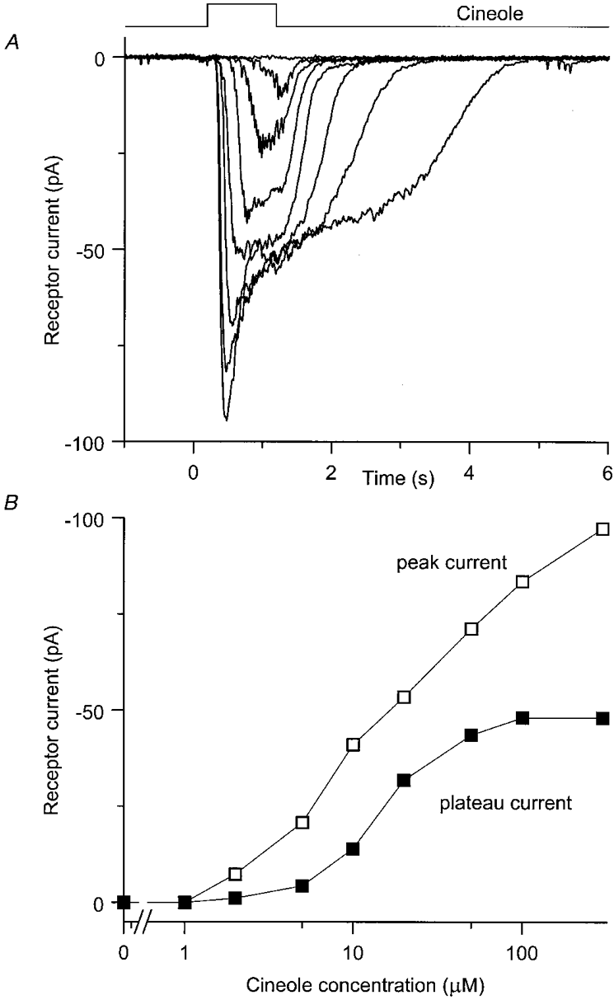

```{r global-options, include=FALSE}
knitr::opts_chunk$set(echo=FALSE,fig.align='center') #warning=FALSE, message=FALSE
```

\newpage
\floatplacement{figure}{!htb}

<!-- Text  -->
# Summary {-}

[@reisert99adaptation] 


# Introduction


\clearpage

# Methods

## Spiking ORN model

> add arrow notations


```{r model, engine="dot", code=xfun::read_utf8('spiking_ORN_model.gv'), out.width="110%", fig.cap="Spiking ORN mechanistic model diagram", cache=TRUE}

```

Olfactory receptor neuron (ORN) transduction model parameters (blue nodes in Fig-\@ref(fig:model))

- **bLR** : Ligand-bound receptors proportion
- **aG** : Active-state G-proteins proportion
- **cAMP** : Cyclic adenosine monophosphate (AMP) proportion
- **Ca** : cytosolic free $Ca^{2+}$ ions
- **IX** : $Ca^{2+}$-dependent intermediary substance proportion
- **CaCaM** : $Ca^{2+}$-calmodulin proportion
- **aCaMK** : active proportion of **CaCaM**-dependent protein kinase (CaMK)
- **V_ORN** : ORN intracellular voltage

Spiking mechanism model parameters implemented in this study (red nodes in Fig-\@ref(fig:model))

- **O_stim** : Odor pulse indicating the stimulus status
- **V_ML** : Morris-Lecar (ML) voltage for spiking mechanism
- **nK** : ML channel for $K^+$-ions activation proportion
- **CaFR** : $Ca^{2+}$-dependent ML spike firing-rate modulation
- **I_ORN** : ORN membrane current prediction


## ORN operation

Ligand-receptor binding
G-protein activation

\begin{equation} 
\begin{split}
O_{\rm stim} &= {\rm od} \cdot [ H(t-t_0) - H(t-t_1) ];\ \ \ \ \  \text{(single pulse)}  \\
\frac{d\ \mathbf{bLR}}{dt} &= {\rm k1} \cdot O_{\rm stim} \cdot ({\rm Rtot} - \mathbf{bLR}) - {\rm r1} \cdot \mathbf{bLR} \\
\frac{d\ \mathbf{aG}}{dt} &= {\rm k2} \cdot \mathbf{bLR} \cdot ({\rm Gtot} - \mathbf{aG}) - {\rm r2} \cdot \mathbf{aG}
\end{split}
\end{equation}

- **_H_(.)** - Heaviside step function, **od** odor-concentration

Intracellular signalling

\begin{equation}
\begin{split}
\frac{d\ \mathbf{cAMP}}{dt} &= synth - pd \cdot \mathbf{cAMP} \\
\frac{d\ \mathbf{Ca}}{dt} &= {\rm inf}\cdot I_{\rm CNG} - J_{\rm NCX} - ({\rm cc1} \cdot \mathbf{Ca} - {\rm cc2} \cdot \mathbf{CaCaM}) \\
\frac{d\ \mathbf{CaCaM}}{dt} &= {\rm cc1} \cdot \mathbf{Ca} - {\rm cc2} \cdot \mathbf{CaCaM} \\
\frac{d\ \mathbf{aCaMK}}{dt} &= {\rm ck1} \cdot \mathbf{CaCaM} - {\rm ck2} \cdot \mathbf{aCaMK} \\
\frac{d\ \mathbf{IX}}{dt} &= {\rm cx1} \cdot \mathbf{Ca} - {\rm cx2} \cdot \mathbf{IX} \\
& synth = \frac{\mathbf{aG} \cdot {\rm smax}}{1 + (\mathbf{aCaMK} / {\rm kinh} )^{\rm ninh}} \\
& J_{\rm NCX} = {\rm ef}\cdot \mathbf{Ca}/[1+(\mathbf{IX}/{\rm kI})^{\rm nI}] \\
\end{split}
\end{equation}

Effector Channel Activity / Receptor Currents

\begin{equation}
\begin{split}
\frac{d\ \mathbf{V_{ORN}}}{dt} &= \frac{1}{\rm cap} \cdot (\ I_{\rm CNG} + I_{\rm Cl(Ca)} + I_{\rm leak}\ ) + {\rm revCp} \cdot \mathbf{\dot{V}_{ML}} \\
I_{\rm CNG} &= \frac{{\rm cnmax} \cdot \mathbf{cAMP}^{\rm n_1} \cdot ({\rm vcng}-\mathbf{V_{ORN}})}{\mathbf{cAMP}^{\rm n_1} + (inhcng \cdot {\rm hmc_1})^{\rm n_1}} \\
& inhcng = 1 + \frac{({\rm inhmax}-1)\cdot \mathbf{CaCaM}^{\rm ninhcng}}{\mathbf{CaCaM}^{\rm ninhcng} + {\rm kinhcng}^{\rm ninhcng}} \\
I_{\rm Cl(Ca)} &= \frac{{\rm clmax} \cdot \mathbf{Ca}^{\rm n_2} \cdot ({\rm vcl} - \mathbf{V_{ORN}})}{\mathbf{Ca}^{\rm n_2} + {\rm hmc_2^{n_2}}} \\
I_{\rm leak} &= {\rm gl} \cdot ({\rm vl} - \mathbf{V_{ORN}})
\end{split}
\end{equation}


> FIG : Conc/Adap

## ML spikes {#ML}

<!-- ML : V & nK -->
\begin{equation}
\begin{split}
\frac{d\ \mathbf{V_{ML}}}{dt} =& \frac{ct}{\rm C_m} \cdot [ I_{\rm ions} + I_{\rm Ca} - {\rm gL} \cdot (\mathbf{V_{ML}} - {\rm v_L}) - {\rm gK} \cdot \mathbf{nK} \cdot (\mathbf{V_{ML}}-{\rm v_K}) \\
& - {\rm gCa} \cdot m_\infty(\mathbf{V_{ML}}) \cdot (\mathbf{V_{ML}}- {\rm v_{Ca}}) \ ] \\
\frac{d\ \mathbf{nK}}{dt} =& \frac{ct \cdot [ n_\infty(\mathbf{V_{ML}}) - \mathbf{nK} ]}{\tau(\mathbf{V_{ML}})}
\end{split}
\end{equation}

<!-- ML : V_ORN vales -->
\begin{equation} (\#eq:MLpar)
\begin{split}
& ct = \frac{100\cdot {\rm maxFR}}{\mathbf{CaFR}},\ I_{\rm Ca} = {\rm \frac{gI_{Ca} \cdot \dot{Ca}}{1 + Ca}},\ I_{\rm ions}={\rm gIons (\mathbf{V_{ORN}} > spkThr )} \\
& {\rm v_{Ca}=120\ mV,\ v_K=-84\ mV,\ v_L=-60\ mV,\ C_m=20\ \mu F/cm^2,} \\ 
& {\rm g_{Ca}=4.4\ m\mho/cm^2,\ g_K=8\ m\mho/cm^2,\ g_L=2\ m\mho/cm^2,}
\end{split}
\end{equation}

<!-- ML : functions -->
\begin{equation} (\#eq:MLfxn)
\begin{split}
\xi(v)=\frac{v-v_c}{v_d},\ &\alpha(v)=\frac{\phi \cosh(\xi/2)}{1+ e^{2\xi}},\ \beta(v)=\frac{\phi \cosh(\xi/2)}{1+ e^{-2\xi}}, \\
n_\infty(v) &= \frac{\alpha(v)}{\alpha(v)+\beta(v)}\ =\  \frac12(1 + \tanh \xi) \\
\tau(v) &= \frac{1}{\alpha(v) + \beta(v)}\ =\  \frac{1}{\phi \cosh(\xi/2)} \\
m_\infty&(v) = \frac12\left(1+ \tanh(\frac{v-v_a}{vb})\right) \\ 
\phi=0.04\ s^{-1};\ &v_a=-1.2,\ v_b=18,\ v_c=2,\ v_d=30\ {\rm mV}.
\end{split}
\end{equation}

### CaFR modulation

<!-- CaFR -->
\begin{equation} 
\frac{d\ \mathbf{CaFR}}{dt} = (1+\mathbf{Ca})*(p(d\mathbf{Ca} > 0) - n(d\mathbf{Ca}<0\  \& \ d\mathbf{CaFR} > m)) \notag
\end{equation} 

### Ionic currents


### ML spikes added in ORN

> Add spike-marks

```{r MLspkORN, out.width = "80%", fig.cap="Resuling ORN current due to Morris-Lecar spikes"}
knitr::include_graphics(c('figs/v1/fig_ML_spikes_with_ORN.png')) 
```

> Add spike-marks

```{r rORN, out.width = "80%", fig.cap="Spiking ORN operation and key underlying component traces"}
knitr::include_graphics(c('figs/v1/fig_spk_all_components.png')) 
```


## Sniffing experiment

### odor stimulus
diff Breaths/min and diff concentration


\clearpage

# Results

## Spiking in ORN


### Response to concentration changes

```{r rCon, out.width = "80%", fig.cap="Resulting spiking ORN for different concentrations"}
knitr::include_graphics(c('figs/v1/fig_spk_compare_conc.png')) 
```

*ORN Spike-response profiling*

```{r MLquant, out.width = "80%", fig.cap="ORN spike-response profiling for different stimulus concentrations"}
knitr::include_graphics(c('figs/v1/fig_spk_compare_conc_quant.png')) 
```

### Response to duration changes

Does not affect much, indicates adaptation

### Response to Adaptation

```{r rAdp, out.width = "80%", fig.cap="Effect of adaptation on ORN spiking"}
knitr::include_graphics(c('figs/v1/fig_spk_compare_adaptation.png')) 
```

Does affect. Hypothesis : longer inter-stim interval will cause lesser adaptation than shorter-intervals

## Optimal sniffing frequency

Number of spikes during the first-sniff vs steady-state

```{r , out.width = "80%", fig.cap="Count"}
knitr::include_graphics(c('figs/v1/fig_sniff_freq_FR_tuning_raw.png')) 
```

### ORN sensitivity vs sniffing frequency

Spike-count / stimulus-duration

Adaptation vs sniffing frequency

```{r , out.width = "80%", fig.cap="Adap"}
knitr::include_graphics(c('figs/v1/fig_sniff_freq_FR_tuning_gain.png')) 
```

# Discussion and Conclusions {#CD}

1. **res-1.**
  
  Figure shows 
  

\clearpage 

# (APPENDIX) Appendix {-}


# Appendix A : Comparing experimental data with simulation {-}

## ORN transduction {-}

### Varying odor-concentration 

```{r r99f2, out.width = "80%", fig.cap="Receptor current responses of an olfactory receptor cell (Fig-2; Reisert 1999)"}
 
```

\@ref(fig:TxConAB)

```{r TxConAB, out.width = "80%", fig.cap="Transduction comparison for various odor concentration", fig.subcap=c('Cell current raw traces', 'Quantification', '(c)'), fig.sep='\\par'}
knitr::include_graphics(c('figs/v1/fig_txn_compare_conc.png','figs/v1/fig_txn_compare_conc_quant.png')) 
```

### Effect of adaptation

```{r r99f4, out.width = "80%", fig.cap="The effect of adaptation on the odour-induced receptor current (Fig-4; Reisert 1999)"}
 
```

```{r TxAdp, out.width = "80%", fig.cap="Transduction comparison for adaptation"}
knitr::include_graphics(c('figs/v1/fig_txn_compare_adaptation.png')) 
```

### Effect of stimulus duration

```{r TxDur, out.width = "80%", fig.cap="Transduction comparison for various odor durations"}
knitr::include_graphics(c('figs/v1/fig_txn_compare_dur.png')) 
```

```{r rDur, out.width = "80%", fig.cap="Spiking ORN response for stimulus duration"}
knitr::include_graphics(c('figs/v1/fig_spk_compare_dur.png')) 
```

## Spikes in ORN {-}

### Experimental data

```{r r99f1, out.width = "80%", fig.cap="Responses of an olfactory receptor cell to odour stimuli of increasing concentration recorded with the suction pipette technique (Fig-1; Reisert 1999)"}
knitr::include_graphics('figs/Reisert1999/fig_spk_compare_conc_R99_F1.png') 
```

```{r r99f5, out.width = "80%", fig.cap="The effect of adaptation on the odour-induced spike firing response (Fig-5; Reisert 1999)"}
knitr::include_graphics('figs/Reisert1999/fig_spk_compare_adaptation_R99_F5.png') 
```

```{r r99f3, out.width = "80%", fig.cap="Collected dose-response data from six cells (Fig-3; Reisert 1999)"}
 
```

### Spike identification

```{r MLspkID, out.width = "80%", fig.cap="Identifying ML-spikes to indicate an event responses of various stimulus concentrations"}
knitr::include_graphics(c('figs/v1/fig_ML_spikes_ID.png')) 
```

### Effect of CaFR

```{r MLspk, out.width = "80%", fig.cap="Altered Morris-Lecar model for action potentials in ORN"}
knitr::include_graphics(c('figs/v1/fig_ML_spikes.png')) 
```

```{r aCaFR1, out.width = "80%", fig.cap="Simulations with keeping CaFR=1 for the entire duration"}
knitr::include_graphics(c('figs/Appendix/supp_fig_ML_ID_w_CaFR_1.png')) 
```

### Differences in adding  Morris-Lecar dynamics

```{r MLover, out.width = "80%", fig.cap="Simulations with ML integrated into molecular process (top) and added ML-spikes separately post-simulation (bottom)"}
knitr::include_graphics(c('figs/Appendix/supp_fig_ML_spikes_OVERLAP.png')) 
```

\clearpage

# Appendix B : Sniffing-simulation plots {-}

```{r f10bpm, out.width = "80%", fig.cap="Sniffing at 10 breaths/min over-all"}
knitr::include_graphics(c('figs/sniff/fig_spk_sniffing_10bpm.png')) 
```

```{r f10bpmSS, out.width = "80%", fig.cap="Sniffing at 10 breaths/min : steady-state response zoom-in"}
knitr::include_graphics(c('figs/sniff/fig_spk_sniffing_10bpm_last.png')) 
```

```{r f35bpm, out.width = "80%", fig.cap="Sniffing at 35 breaths/min over-all"}
knitr::include_graphics(c('figs/sniff/fig_spk_sniffing_35bpm.png')) 
```

```{r f50bpm, out.width = "80%", fig.cap="Sniffing at 50 breaths/min over-all"}
knitr::include_graphics(c('figs/sniff/fig_spk_sniffing_50bpm.png')) 
```

\clearpage

# Appendix C : Codes {-}

## Matlab simulation {-}

simulate_ORN.m

## All other codes {-}

- All Matlab simulation script, Matlab scripts for all figures, tex/md files for generating this report and figures files are available here : 
  + <[Google Drive](https://drive.google.com/drive/folders/1N4nMSW9fY1oOydNJQu4aa85tXOV_euu4?usp=sharing)>
  + <[github.com/shivanshdave](https://drive.google.com/drive/folders/1N4nMSW9fY1oOydNJQu4aa85tXOV_euu4?usp=sharing)>

# References

